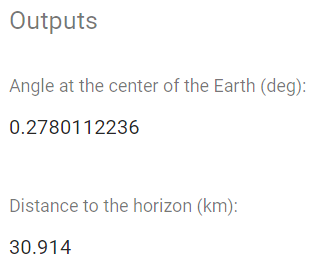

# Welcome to the project website!

This is the website of our Mathematics project "Application of Circle Theorems with Marine Navigation". We were given a big topic area to work with, and this project idea came up by combining two of these subject areas (Core Mathematics and Additional Mathematics).

In this project, we investigate and explore the applications of circle theorems with marine navigation, and we ended up with **finding the distance to the horizon**. We think that this skill is very useful for marines and seapeople, as they can figure out how far something is very easily. Even nowadays, we take the GPS for granted, but it is still very important to learn the concepts and the maths behind it. Our mathematical focus is on circle theorems (tangents, angle-in-a-semi-circle postulate) and trigonometry, please see the [research design](./documents/Research Design.pdf) for elaboration and an explanation on how we will apply these concepts into our project. For further reading on Marine Navigation, Circle Theorems and Trigonometry, please see the [introduction](./documents/Introduction.pdf) and [background](./documents/Background.pdf).

We thank you for visiting our website!

* * *

## Calculator

If you are looking for a calculator to automatically calculate the distance to the horizon, then the below link is for you. It uses the exact same theorems, including trigonometry, that we use in this project. It is written in JavaScript.

[See the calculator](./horizon)

***

## Problems

### Example 1

[**(See image)**](./documents/Problem1.png) A man on the ship need to know the nearest distance from the boat to the lighthouse and how long will the ship take to get to there. He knows that lighthouse is 90 meters tall and the earth radius (6371 km). The ship speed is 60 kilometers per hour.

Find x.

r = Earth's radius

h = Height of the lighthouse

[See solution](./solution1)

### Example 2

[**(See image)**](./documents/Problem2.png) The ship is traveling at the speed of 800 km/h. The pilot wants to know the distance to the 600 m tower and the y angle.

Find x.

r = Earth's radius

h = Height of the tower

[See solution](./solution2)

***

## Further reading
*   [Marine Navigation - Mathematics: Distance of Horizon on nauticalissues.com](http://www.nauticalissues.com/en/math0.html)
*   [Navigating by the Numbers on teachengineering.org](https://www.teachengineering.org/lessons/view/cub_navigation_lesson03)
